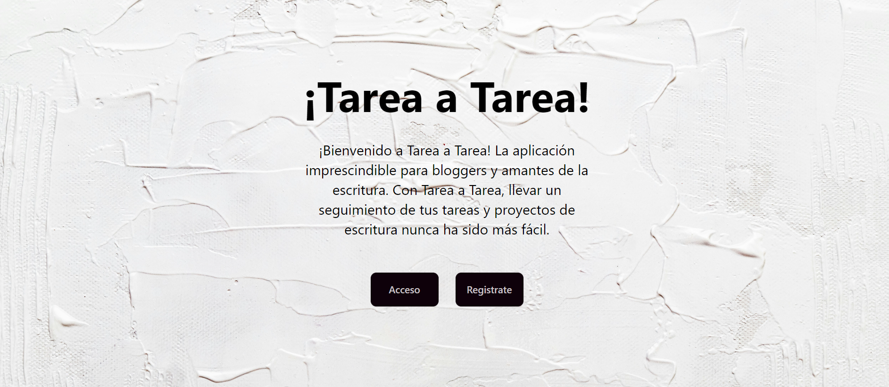
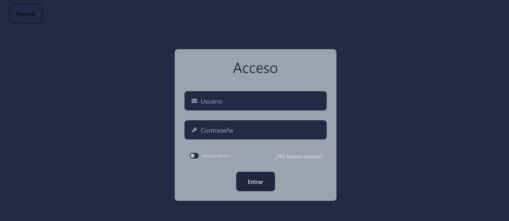
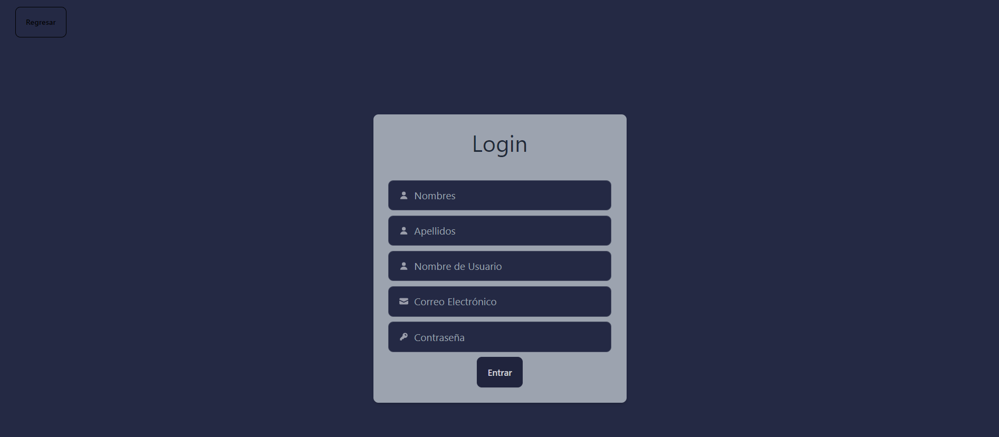
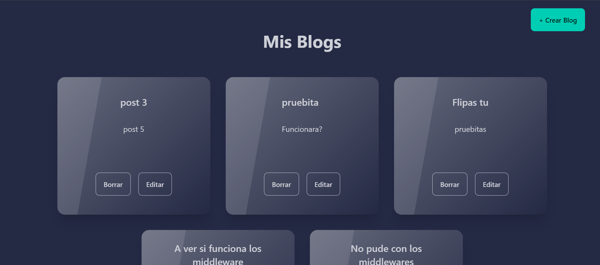
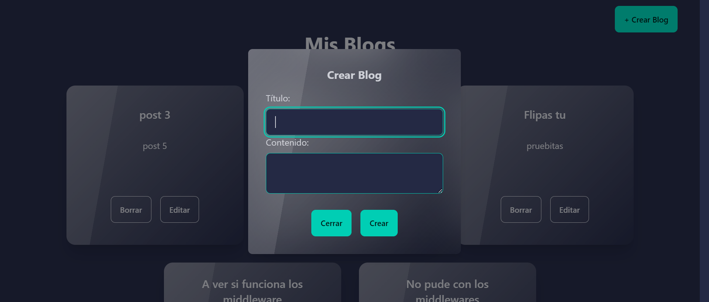
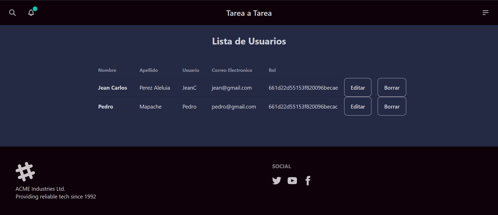
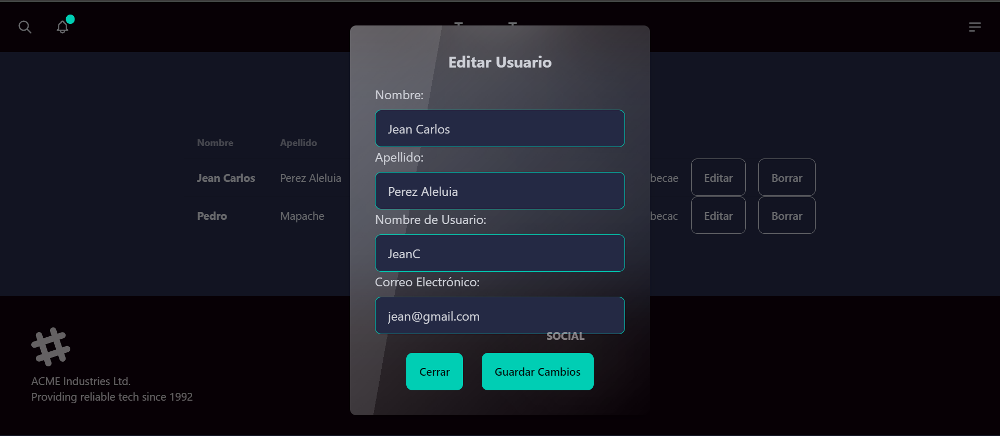

¡Bienvenido a Tarea a Tarea! Esta plataforma está diseñada para la gestión de blogs, permitiendo a los administradores crear, editar y eliminar tareas fácilmente, mientras que los usuarios pueden disfrutar de la visualización de las tareas existentes.

## Asi se ve nuestra web 









## Como empezar :rocket:

### Instalación

Para comenzar a usar nuestra aplicación en tu entorno local, sigue estos pasos:

#### Clona el repositorio:

```bash
git clone https://github.com/JeanCarlosPerez/DesarrolloSeguro.git
```

#### Instala las dependencias:

```bash
cd scouzpro/client
npm install

cd scouzpro/backend
npm install
```

#### Inicia el servidor:

##### En backend:

```bash
npm run dev
```

##### En frontend

```bash
ng build
ng serve
```

Finalmente, abre tu navegador web y visita [http://localhost:4200](http://localhost:4200)

## Deployment :stars:

Y este nuestro Servicio [https://desarrolloseguro.onrender.com/](https://desarrolloseguro.onrender.com/)

También puedes simplemente visitar nuestro despliegue de la aplicación: [https://tareaatarea.netlify.app/](https://tareaatarea.netlify.app/)

## Features
Nuestra aplicación ofrece las siguientes funcionalidades principales:

- Registro de Usuarios:El administrador podra Gestionar los usuarios que cualquier persona podra crear desde el form de register.

- Creación de Blog: El administrador podrar crear blogs desde su panel personalizado

- Gestión de Perfiles: el administrador podra gestionar los usuarios que esten registrados

- Seguridad: La seguridad de los datos de los usuarios es una prioridad. Implementamos medidas de seguridad robustas para proteger la información confidencial.

## Tech Stack :cd:
Nuestra aplicación utiliza el siguiente stack tecnológico:

**Design:**   

**Client:**   

**Lenguage:**    

**Server:**     

**Testing:**  
## Desarrolladores :trophy:

- :man_technologist: [@JeanCarlosPerez](https://github.com/JeanCarlosPerez) 

## ¡Gracias!

## ¡Gracias por usar Tarea a Tarea! Si tienes alguna pregunta o sugerencia, no dudes en ponerte en contacto con nosotros. ¡Que disfrutes visualizando nuestro Blogs!

